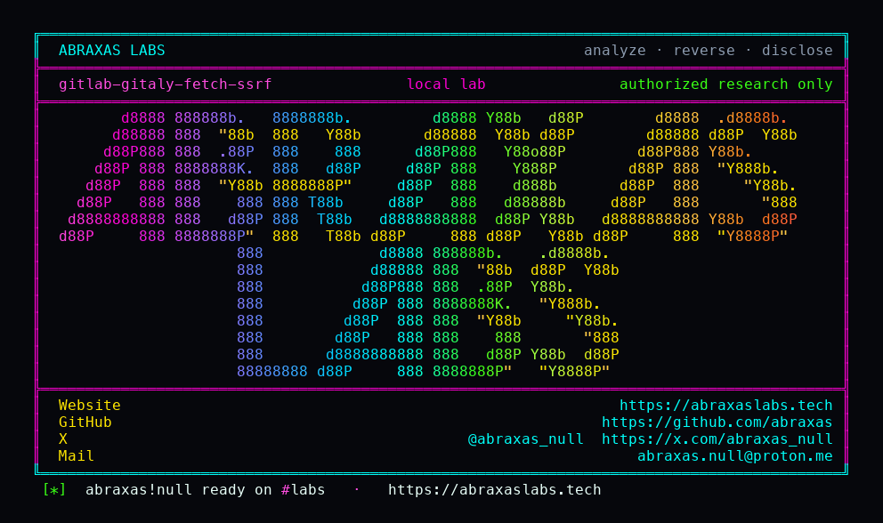

<p align="center">
  
</p>

<p align="center">
  <a href="https://abraxaslabs.tech"><strong>abraxaslabs.tech</strong></a>
  &nbsp;·&nbsp;
  <a href="https://github.com/abraxas">github.com/abraxas</a>
  &nbsp;·&nbsp;
  <a href="https://x.com/abraxas_null">@abraxas_null</a>
  &nbsp;·&nbsp;
  <a href="mailto:abraxas.null@proton.me">abraxas.null@proton.me</a>
  &nbsp;·&nbsp;
  <a href="https://github.com/abraxas/gitlab-gitaly-fetch-ssrf">gitlab-gitaly-fetch-ssrf</a>
</p>

# gitlab-gitaly-fetch-ssrf

**GitLab** CE `19.4.1` - GitLab Inc.

GitHub Enterprise / Bitbucket Server import (and Direct Transfer, when that flag is on) skip `Projects::ImportService#get_resolved_address`. `Repository#fetch_as_mirror` defaults `resolved_address: ""`. Gitaly `FetchRemote` / `CreateRepositoryFromURL` resolves the clone hostname again. UrlBlocker already allowed a public A-record. Rebind, and git-HTTP objects land in the imported project.

**A signed-in user who can run GitHub Enterprise import can make Gitaly git-fetch a host that is no longer the IP UrlBlocker pinned.**

| | |
|---|---|
| ID | no CVE yet |
| CWE | [CWE-918](https://cwe.mitre.org/data/definitions/918.html), [CWE-367](https://cwe.mitre.org/data/definitions/367.html) |
| CVSS | **High: 7.7** `CVSS:3.1/AV:N/AC:H/PR:L/UI:N/S:C/C:H/I:L/A:N` |
| Product | [GitLab CE](https://gitlab.com/gitlab-org/gitlab) |
| Affected | **19.4.1-ce.0** (`26212baacadb` on the v19.4.1-ee tree) |
| Auth | authenticated user, GitHub Enterprise / Bitbucket Server importer |
| License | [GNU Affero GPL v3.0](LICENSE) |
| Lab | `127.0.0.1` only |

## What an attacker can do

Point GitHub Enterprise import at a hostname they control. Rails `UrlBlocker.validate!` allows a public A-record. `ParallelImporter.imports_repository?` is true, so ImportService never pins. `RepositoryImporter#fetch_as_mirror` calls Gitaly with an empty `resolved_address`. Gitaly `git` HTTP-fetches whatever that name is now. The imported repo contains the objects.

On all-in-one omnibus that is the worker loopback. Direct `http://127.0.0.1` clone hostnames fail closed. Repository-by-URL import already pins. Direct Transfer needs `bulk_import_enabled` (self-managed default false).

Same product, sibling leftovers: [Gitea HTTPS import pin drop](https://github.com/abraxas/gitlab-gitea-import-ssrf), [webhook 0.0.0.0/8](https://github.com/abraxas/gitlab-webhook-0net-ssrf).

## How I found it

I read the 19.4.1 patch notes, then importers. `Projects::ImportService#get_resolved_address` rewrites the hostname to the validated IP and passes it into Gitaly. GitHub and Bitbucket Server parallel importers set `imports_repository?` and skip that path.

```ruby
project.repository.fetch_as_mirror(project.unsafe_import_url, refmap: refmap, forced: true)
```

`fetch_as_mirror` defaults `resolved_address: ""`. Direct Transfer's `repository_pipeline.rb` even calls `validate!` and discards the return value.

I stood up stock [`gitlab/gitlab-ce:19.4.1-ce.0`](https://hub.docker.com/r/gitlab/gitlab-ce). CE `import_sources` starts empty; the lab enables GitHub. `POST /api/v4/import/github` with `github_hostname=http://ghe.lab:18080`. Catcher in the GitLab netns speaks fake GHE JSON plus `git http-backend`. Seed repo blob `WITNESS` is `GITLAB-GITALY-FETCH-SSRF-WITNESS`.

`GET /api/v4/projects/1/repository/files/WITNESS/raw?ref=master` returned the witness. Gitaly log: `FetchRemote` `grpc.code=OK` on `root/ghe-ssrf`. Catcher: `git/2.55` `info/refs` and `git-upload-pack`. Negative `github_hostname=http://127.0.0.1:18080` is 400 Invalid URL.

Wrong turns already recorded: seed `CveLabRoot9!` is a WeakPasswords reject (`root` substring); 19.4 pads past that check at 64 chars; Faraday cannot connect to a public IP that is not the catcher, so the harness REDIRECTs `1.1.1.1:18080` while UrlBlocker still sees a public A; git-HTTP can win before `GET /repos/org/repo` flips DNS; GitLab 502s mid-import and then the file is there anyway. A reverse shell. Theatre. The oracle is the imported blob plus Gitaly `FetchRemote`.

## Lab

```bash
cd lab
./run.sh
```

Target **only** `http://127.0.0.1:18410`. GitLab CE wants several GB RAM. Authorized lab only.

```text
negative-loopback status=400 Invalid URL
witness-import status=201 import_status=scheduled
file-final http=200 body='GITLAB-GITALY-FETCH-SSRF-WITNESS'
SUCCESS GITLAB-GITALY-FETCH-SSRF imported-witness git-fetch-no-pin GITLAB-GITALY-FETCH-SSRF-WITNESS
```

## The leftover

```ruby
def import_repository
  project.ensure_repository
  refmap = Gitlab::GithubImport.refmap
  project.repository.fetch_as_mirror(project.unsafe_import_url, refmap: refmap, forced: true)
```

Pass `get_resolved_address` into `fetch_as_mirror` the way repository-by-URL import already does. Do not discard `UrlBlocker.validate!` in Direct Transfer either.

## References

- [gitlab.com/gitlab-org/gitlab](https://gitlab.com/gitlab-org/gitlab) tag [v19.4.1-ee](https://gitlab.com/gitlab-org/gitlab/-/tree/v19.4.1-ee)
- [`repository_importer.rb`](https://gitlab.com/gitlab-org/gitlab/-/blob/v19.4.1-ee/lib/gitlab/github_import/importer/repository_importer.rb) · [`repository.rb`](https://gitlab.com/gitlab-org/gitlab/-/blob/v19.4.1-ee/app/models/repository.rb) · [`import_service.rb`](https://gitlab.com/gitlab-org/gitlab/-/blob/v19.4.1-ee/app/services/projects/import_service.rb)
- Same product: [gitlab-gitea-import-ssrf](https://github.com/abraxas/gitlab-gitea-import-ssrf) · [gitlab-webhook-0net-ssrf](https://github.com/abraxas/gitlab-webhook-0net-ssrf)
- [CWE-918](https://cwe.mitre.org/data/definitions/918.html) · [CWE-367](https://cwe.mitre.org/data/definitions/367.html)

## License

GNU Affero GPL v3.0. See [LICENSE](LICENSE). Loopback lab only. No warranty.
